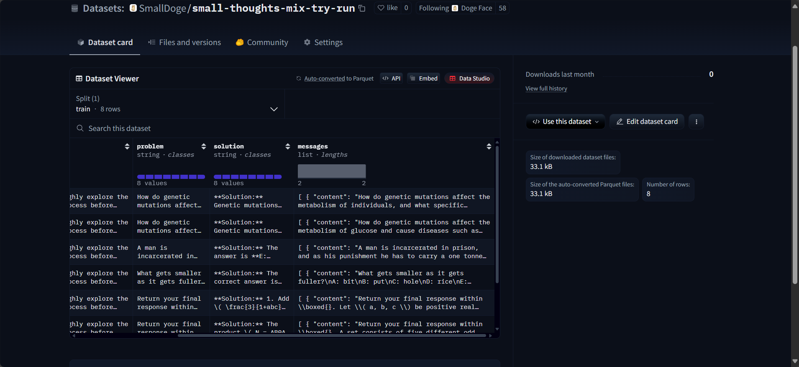

<div align="center">
  
</div>

<hr>

<div align="center">

[](https://discord.gg/P2yYH95N)
[](https://huggingface.co/datasets/SmallDoge/SmallThoughts)
[](https://opensource.org/licenses/Apache-2.0)

*Small Datasets, Big Progress!*

---

*Our goal is to build a data processing pipeline that provides high-quality datasets for all stages of language model training*

<h4>

English | [简体中文](./README_zh.md)

</h4>

</div>


# News

* **[2025-5-12]** 🎉Released [SmallTalks](https://huggingface.co/datasets/SmallDoge/SmallTalks) dataset.
* **[2025-3-8]** 🎉Released [SmallThoughts](https://huggingface.co/datasets/SmallDoge/SmallThoughts) dataset.


# About

This project aims to build a comprehensive **dataset processing pipeline** that provides high-quality datasets for all stages of language model training. This includes datasets for:

*   **Pre-training:** Large-scale, diverse text corpora.
*   **Instruction Fine-tuning:** Datasets like `SmallTalks` to align models with user instructions.
*   **Reasoning Fine-tuning:** Datasets like `SmallThoughts` to enhance models' reasoning capabilities.
*   **Reinforcement Learning:** Datasets to further refine model behavior through reward mechanisms.

Our goal is to support the development of more capable and robust language models by providing meticulously curated data for each critical training phase.


# Requirements

- Python >= 3.10
- Linux operating system
- DeepSeek API Key
- Hugging Face API Key

> [!TIP]
> If you are a Windows user, you can use WSL2 to create an Ubuntu subsystem to run Linux commands on Windows.


# Installation

```bash
git clone https://github.com/SmallDoges/small-datasets.git
cd small-datasets
pip install .
```


# Usage

```bash
python src/small_datasets/generation.py \
--task reasoning \
--try_run \
--base_url https://api.deepseek.com \
--model_name deepseek-reasoner \
--temperture 0.0 \
--max_tokens 8192 \
--system_prompt_type english \
--max_requests_per_minute 1000 \
--max_tokens_per_minute 1000000000 \
--cache_dir ./cache \
--num_proc 4
```

Then follow the instructions in the terminal.

You can get the following dataset under your huggingface repository by running with the `--try_run` parameter.



If you need the complete distilled dataset, please remove the `--try_run` parameter.


# Related Projects

- [Openthoughts](https://github.com/open-thoughts/open-thoughts)
- [DeepSeek R1](https://huggingface.co/deepseek-ai/DeepSeek-R1)
- [Curator](https://github.com/bespokelabsai/curator)


# Citation

If you use this codebase, or find our work valuable, please cite our repository:

```bibtex
@misc{small-thoughts,
  author = {Jingze, Shi and Yifan, Wu and Bingheng, Wu and Yuyu, Luo},
  title = {Small Thoughts},
  year = {2025},
  month = {march},
  url = {https://github.com/SmallDoges/small-thoughts}
}
```